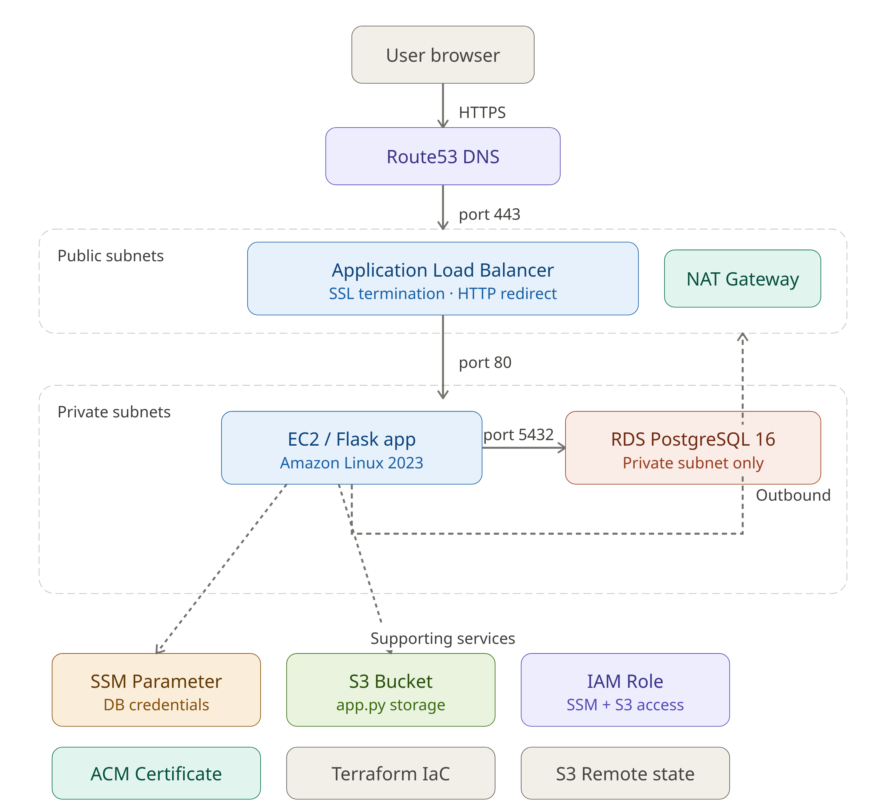

# Flask RDS Platform

A production-style Flask web application deployed on AWS, featuring a private RDS PostgreSQL database, Application Load Balancer with HTTPS, API key authentication, CI/CD pipeline, and fully automated infrastructure via Terraform.

**Live URL:** https://app.limonlab.online

## Architecture



### Traffic Flow
```
User → Route53 → ALB (HTTP/80 → redirect) → ALB (HTTPS/443) → EC2/Flask (HTTP/5000) → RDS PostgreSQL (5432)
```

### Infrastructure Overview
- **VPC** — Custom VPC with public and private subnets across 2 AZs
- **ALB** — Application Load Balancer in public subnets, handles SSL termination
- **EC2** — Flask app running in private subnet, no public IP, managed via systemd
- **RDS** — PostgreSQL 16 in private subnet, only accessible from EC2
- **NAT Gateway** — Allows EC2 outbound internet access from private subnet
- **ACM** — SSL certificate for custom domain
- **Route53** — DNS routing to ALB
- **SSM Parameter Store** — Stores database credentials and API key securely
- **S3** — Stores application code, pulled by EC2 at boot and on every deployment
- **CloudWatch Agent** — Ships Flask logs to CloudWatch Log Group
- **IAM** — EC2 role with SSM, S3, and CloudWatch permissions

---

## Tech Stack

| Layer | Technology |
|---|---|
| Application | Python 3, Flask |
| Database | PostgreSQL 16 (AWS RDS) |
| Infrastructure | Terraform |
| Compute | AWS EC2 (Amazon Linux 2023) |
| Process Management | systemd |
| Networking | VPC, ALB, Route53, ACM |
| Secrets | SSM Parameter Store |
| Logging | CloudWatch Agent + CloudWatch Logs |
| CI/CD | GitHub Actions |
| Deployment | S3 + SSM Run Command |

---

## API Endpoints

All endpoints except `/health` and `/` require an API key in the request header:
```
X-API-Key: your-api-key
```

| Method | Endpoint | Auth Required | Description |
|---|---|---|---|
| GET | / | No | Returns app status |
| GET | /health | No | Health check — returns 200 |
| GET | /users | Yes | Fetch all users from database |
| POST | /users | Yes | Add a new user to database |

### Example POST request
```json
{
    "name": "John Smith",
    "email": "john@gmail.com"
}
```

### Example GET /users response
```json
[
    [1, "John Smith", "john@gmail.com", "2026-05-28T16:58:00"]
]
```

---

## Project Structure

```
flask-rds-platform/
├── app/
│   └── app.py                      # Flask application
├── docs/
│   └── architecture.png            # Architecture diagram
├── scripts/
│   ├── ec2_logs.py                 # Fetch and filter EC2 boot logs
│   └── cloudwatch_logs.py          # Fetch Flask error logs from CloudWatch
├── .github/
│   └── workflows/
│       └── deploy.yml              # GitHub Actions CI/CD pipeline
├── terraform/
│   ├── vpc.tf                      # VPC, subnets, NAT Gateway
│   ├── security_groups.tf          # ALB, EC2, RDS security groups
│   ├── ec2.tf                      # EC2 instance
│   ├── rds.tf                      # RDS PostgreSQL instance
│   ├── alb.tf                      # ALB, listeners, target group
│   ├── iam.tf                      # IAM role and policies
│   ├── ssm.tf                      # SSM Parameter Store
│   ├── acm.tf                      # SSL certificate
│   ├── route53.tf                  # DNS records
│   ├── s3.tf                       # S3 bucket and app upload
│   ├── providers.tf                # AWS provider configuration
│   ├── variables.tf                # Variable definitions
│   ├── outputs.tf                  # Output values
│   └── user_data.sh                # EC2 bootstrap script
├── .gitignore
└── README.md
```

---

## CI/CD Pipeline

Every push to the `main` branch triggers the GitHub Actions pipeline:

1. Uploads new `app.py` to S3
2. Sends SSM Run Command to EC2 — pulls new file from S3 and restarts Flask via systemd
3. No SSH required, no manual steps

---

## Deployment

### Prerequisites
- Terraform installed
- AWS CLI configured with profile `limonlab`
- S3 bucket for remote state: `limonlab-terraform-state`
- GitHub Secrets configured: `AWS_ACCESS_KEY_ID`, `AWS_SECRET_ACCESS_KEY`, `EC2_INSTANCE_ID`

### Deploy
```bash
cd terraform
terraform init
terraform plan
terraform apply
```

### Destroy
```bash
terraform destroy
```

> ⚠️ NAT Gateway costs ~$32/month. Destroy when not in use.

---

## Security Notes
- EC2 has no public IP — only reachable via ALB or SSM Session Manager
- RDS has no public access — only reachable from EC2 security group
- Database credentials and API key stored in SSM Parameter Store — never hardcoded
- HTTPS enforced — HTTP redirects to HTTPS via ALB listener rule
- API key authentication on all `/users` endpoints
- Timing-safe key comparison using `secrets.compare_digest()`

---

## Roadmap

- **V1** ✅ Flask + RDS PostgreSQL, ALB, HTTPS, SSM, Terraform
- **V2** ✅ systemd, CloudWatch logging, API key authentication, GitHub Actions CI/CD
- **V3** 🔲 Auto Scaling Group, OIDC authentication for GitHub Actions


